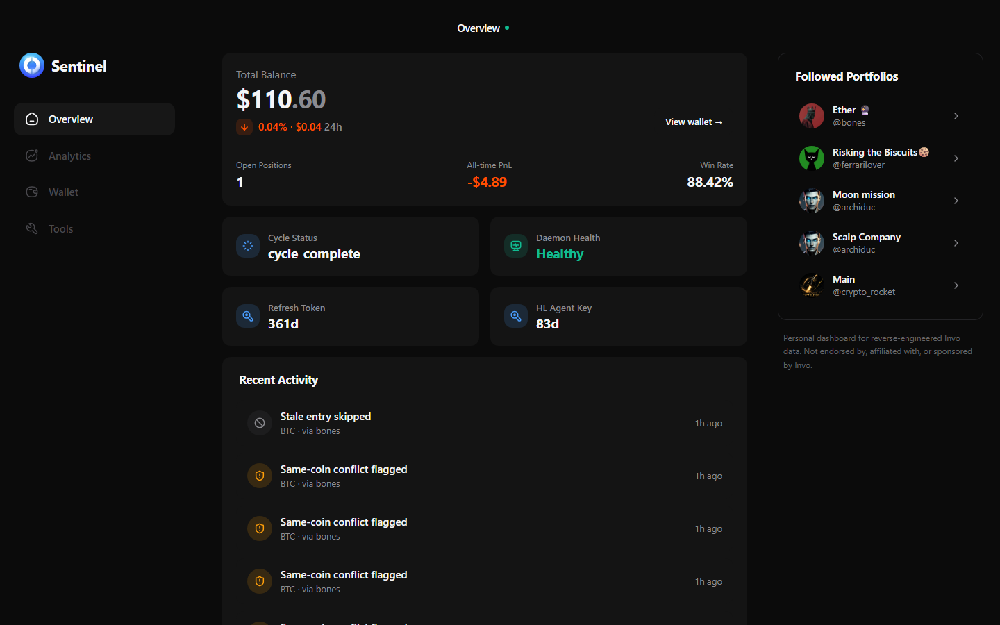
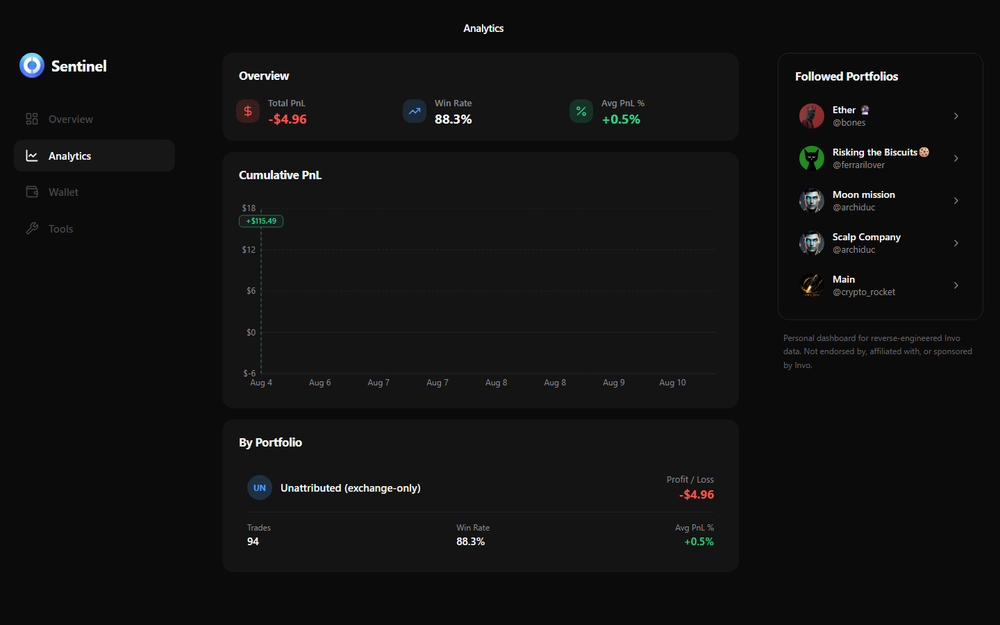
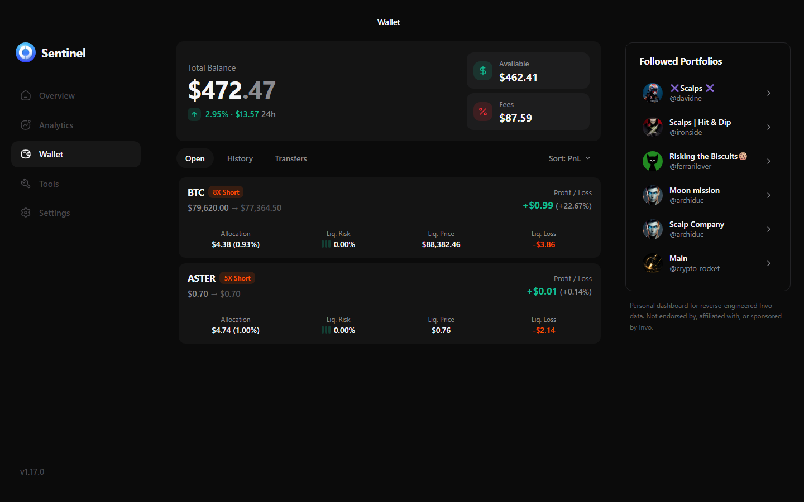
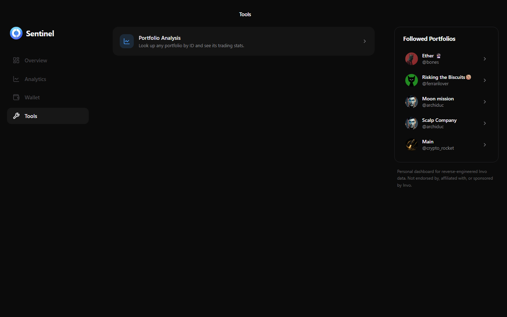
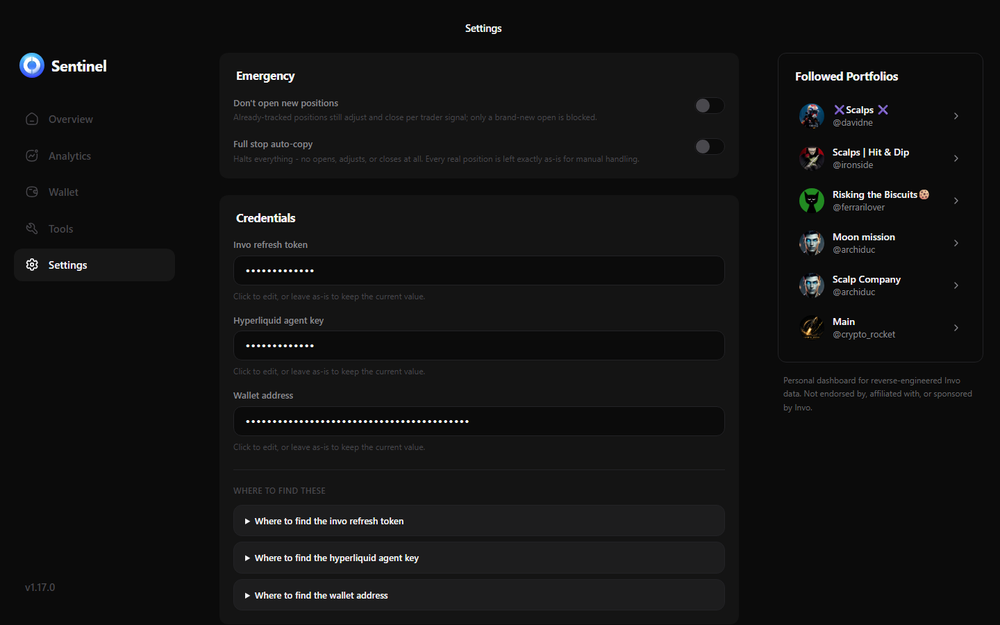

# invo-sentinel

Automatic copy trading for [Invo](https://app.invoapp.com) followed portfolios, executed on [Hyperliquid](https://hyperliquid.xyz). A plain polling daemon mirrors every open, margin adjustment, and close from every trader you follow, with one guardrail: your margin per trade is always clamped into a `[min%, max%]` band of your own equity, and leverage is capped. **Trades are never skipped for being "too risky," only resized**, with one deliberate exception: a trade that's already stale and profitable by the time it's seen (see [Skipping stale entries](#skipping-stale-already-profitable-entries)).

Forked from [`AKCodez/invo-copy-trader`](https://github.com/AKCodez/invo-copy-trader) - kept the reverse-engineered API/signing knowledge, replaced the AI decision loop with deterministic logic.

## Contents

- [What it does](#what-it-does)
- [Easy install (no terminal)](#easy-install-no-terminal)
- [Quick start (from source)](#quick-start-from-source)
- [Credentials](#credentials)
- [Risk configuration](#risk-configuration)
- [Commands](#commands)
- [Dashboard UI](#dashboard-ui)
- [Auditing (`npm run reconcile`)](#auditing-npm-run-reconcile)
- [Running continuously](#running-continuously)
- [Same-coin conflicts between traders](#same-coin-conflicts-between-traders)
- [Manual intervention](#manual-intervention)
- [Disclaimer](#disclaimer)

## What it does

Every poll cycle (default 5s):

1. Fetches the portfolios you follow, refreshed every cycle.
2. For each one, fetches their **currently open** investments - a full snapshot, not an event stream, so restarting the daemon doesn't miss anything.
3. For each open trade: computes your target margin from the trader's own margin %, clamped into your configured band, and places whatever delta order gets you there. Leverage is capped the same way.
4. Anything you're tracking that's no longer in a trader's open list gets closed fully, unclamped.
5. Cross-checks your real Hyperliquid positions against what's tracked, and flags anything untracked instead of silently ignoring it.

## Easy install (no terminal)

For anyone who just wants everything running without `git clone` or a terminal full of commands - Windows, macOS, and Linux all get their own release download, not just Windows:

1. Grab the archive for your OS from this repo's [Releases](../../releases) page and unzip it anywhere: `invo-sentinel-windows-x64.zip`, `invo-sentinel-macos-arm64.zip`, `invo-sentinel-linux-x64.zip`, or `invo-sentinel-linux-arm64.zip` (Raspberry Pi 4/5 and other arm64 boards).
2. Open `GETTING-STARTED.txt` inside - it's a short, platform-specific version of just this section, generated fresh for your OS.
3. Run `start.bat` (Windows, double-click) or `./start.sh` (macOS/Linux, from a terminal - macOS also needs a one-time Gatekeeper bypass, see `GETTING-STARTED.txt`). This is the **only** thing you need to run - it starts both the daemon and the dashboard UI, and opens the UI in your browser once it's up. The actual daemon program and its data/logs live inside the `bin/` folder, and the dashboard's own files live inside `ui/` - neither is meant to be opened directly; keeping them out of the top level is deliberate, so there's exactly one obvious file to run instead of several similarly-important-looking ones. A console window/terminal stays open while it runs - closing it stops everything (see [Running continuously](#running-continuously) below for keeping it running unattended, including across reboots, or run `start.bat --background` / `./start.sh --background` to free the window immediately).
4. Everything starts idle and waits for the 3 required values from [Credentials](#credentials) below - nothing crashes or exits if they're missing. The dashboard's own setup wizard is the easiest way to supply them.

**One real dependency the daemon itself doesn't have:** the dashboard UI needs Node.js installed (the daemon is a fully self-contained executable and needs nothing). If Node isn't found, `start.bat`/`start.sh` say so plainly and still start the daemon on its own - install Node from [nodejs.org](https://nodejs.org) and re-run for the UI too.

The wrapper script restarts the daemon automatically if it crashes, same as `scripts/run.sh` does for the from-source setup below.

## Quick start (from source)

Everything below this point is the developer/source path - cloning the repo and running it with Node - which the easy-install path above exists to avoid.

```bash
npm install
cp .env.example .env
# fill in .env - see Credentials below
npm run preflight   # sanity checks: env, HL connection, Invo auth, balance
npm run dry-run      # watch it decide without placing real orders
./scripts/run.sh     # go live, with auto-restart on crash - also starts the dashboard UI alongside it
```

Run it somewhere that stays on - a closed laptop lid or terminal kills a foreground process. See [Running continuously](#running-continuously) for a real process supervisor.

## Credentials

Create `.env` (see `.env.example`):

```
INVO_REFRESH_TOKEN=eyJ...
HL_AGENT_KEY=0x...
WALLET_ADDRESS=0x...
```

**`INVO_REFRESH_TOKEN`** (~350 day TTL). Log into `app.invoapp.com` in Chrome, open DevTools console, and run:

```javascript
const aesKeyB64 = localStorage.getItem('FlutterSecureStorage');
const encryptedRefresh = localStorage.getItem('FlutterSecureStorage.REFRESH_TOKEN');
const [ivB64, ctB64] = encryptedRefresh.split('.');
const iv = Uint8Array.from(atob(ivB64), (c) => c.charCodeAt(0));
const ct = Uint8Array.from(atob(ctB64), (c) => c.charCodeAt(0));
const keyBytes = Uint8Array.from(atob(aesKeyB64), (c) => c.charCodeAt(0));
const cryptoKey = await crypto.subtle.importKey('raw', keyBytes, 'AES-GCM', false, ['decrypt']);
const decrypted = await crypto.subtle.decrypt({ name: 'AES-GCM', iv }, cryptoKey, ct);
console.log(new TextDecoder().decode(decrypted)); // 3 dot-separated parts; that's your token
```

**`HL_AGENT_KEY`** (~90 day TTL). DevTools → Application → IndexedDB → `invo_hl_agents` → `agents` → `current` → `privateKey`.

**`WALLET_ADDRESS`**: DevTools → Application → Local Storage → value of `flutter.hl.masterAddress`.

## Risk configuration

```
MIN_MARGIN_PCT=2      # never risk less than this % of your equity per trade
MAX_MARGIN_PCT=5      # never risk more than this %, no matter what the trader did
MAX_LEVERAGE=30        # leverage is capped here, not rejected; blank = no cap
STALE_ENTRY_MAX_AGE_MINUTES=1  # see below
STALE_ENTRY_MAX_PROFIT_PCT=1
POLL_INTERVAL_MS=5000
LOG_RETENTION_HOURS=24
LOG_MAX_TOTAL_MB=200
HEALTHCHECK_PING_URL=  # optional dead-man's-switch ping (e.g. healthchecks.io)
```

`MIN_MARGIN_PCT`/`MAX_MARGIN_PCT` can also be passed positionally, overriding `.env`: `npm run start -- 2 5`.

You can also give any specific followed portfolio its own margin band, overriding the global one - edit `data/.copy-portfolio-risk.json` (auto-created and kept in sync with who you follow; your own edits are never overwritten).

### Skipping stale, already-profitable entries

The one exception to "never skip, only resize": an entry older than `STALE_ENTRY_MAX_AGE_MINUTES` is **permanently** skipped regardless of its current PnL - this matters most right after a same-coin conflict clears (see [below](#same-coin-conflicts-between-traders)), where opening a long-stale idea fresh at 0% PnL isn't really mirroring it. An entry still within that window but already up more than `STALE_ENTRY_MAX_PROFIT_PCT`% is skipped for just that cycle, re-checked fresh next time.

### Hyperliquid's minimum order size

Hyperliquid rejects any order under $10 notional. A brand-new open that computes under that floor is bumped up to just over $10 instead of skipped. An incremental top-up that lands under $10 is left untouched and retried next cycle once the target has drifted further - it can't be placed at any size correction right now.

## Commands

| Command                                                                 | What it does                                                                  |
| ----------------------------------------------------------------------- | ----------------------------------------------------------------------------- |
| `npm run preflight`                                                     | Env, Hyperliquid connection, Invo auth, balance/positions - run this first    |
| `npm run dry-run`                                                       | Full pipeline, no real orders; everything logged as `dry_run_*`               |
| `npm start` / `./scripts/run.sh`                                        | The real thing. `run.sh` adds auto-restart on crash                           |
| `npm run adopt -- <baseId> <coin> <long\|short> <leverage> <marginUsd>` | Manually resolve a same-coin-multiple-traders conflict                        |
| `npm run close -- <coin>`                                               | Emergency manual close; stopping the daemon does **not** close open positions |
| `npm run reconcile -- --hours=6`                                        | Read-only audit; see below                                                    |

## Dashboard UI

A local-only, read-only Next.js dashboard lives in `ui/`. It views daemon state and Invo/Hyperliquid data, places no orders, and never touches `data/.copy-state.json` or any other daemon file.

```bash
cd ui && npm install    # one-time
npm run ui:dev           # dev server, from repo root
npm run ui:build          # production build
npm run ui:start           # serve the production build
```

Port defaults to 4400; copy `ui/.env.local.example` to `ui/.env.local` to change it. It's a fully separate process from the daemon - safe to run both concurrently.

**Overview** - total balance, open positions, all-time PnL/win rate, daemon health, refresh-token and agent-key expiry, recent activity.



**Analytics** - cumulative PnL over time, win rate, trade stats, and breakdowns by portfolio and by coin, all net of fees.



**Wallet** - live open positions with full detail (entry/mark price, margin, notional, funding, liquidation distance), paginated trade history with a per-trade lifecycle timeline, and deposit/withdrawal history.



**Tools → Portfolio Analysis** - look up any Invo portfolio by ID, followed or not, and see its real stats straight from Invo's own API.



**Settings** - quick configuration for full daemon setup and preferences.



The right rail lists your followed portfolios; clicking one opens the same detail view as the Tools page.

## Auditing (`npm run reconcile`)

The live daemon's own logs record what it _decided_, not proof it was right. `npm run reconcile -- --hours=6` cross-checks recent behavior against Invo's closed-investment history and Hyperliquid's own fill history - two sources the live daemon never consults - and flags anything that doesn't add up: an untracked open with no explanation, a close it missed or was slow on, a fill it can't verify, or a position that closed with no daemon record of it at all (e.g. something else with signing authority over the same wallet closed it). Read-only, places no orders.

## Running continuously

`scripts/run.sh`/`start.bat` restart the daemon if the process exits, but nothing brings it back after a reboot on its own - for that, use your OS's service manager.

**Windows (packaged `start.bat`, no admin rights needed):**

The simplest option - a Startup folder shortcut - starts `start.bat` at login, and `start.bat`'s own loop already covers restart-on-crash:

1. Press `Win+R`, type `shell:startup`, Enter - this opens your per-user Startup folder.
2. Right-click → New → Shortcut, point it at `start.bat` (wherever you unzipped the release), and give it a `Start in` folder matching that same directory (Shortcut Properties → "Start in") - `start.bat` resolves paths relative to its own location, but a shortcut's default working directory isn't always that folder, so this avoids it looking for the daemon binary in the wrong place.

For running before any user logs in (e.g. a headless machine that reboots unattended), use **Task Scheduler** instead: Create Task → Triggers → "At startup" → Actions → Start a program (`start.bat`, "Start in" set to its folder) → Settings → check "Restart the task if it fails" as a second layer on top of `start.bat`'s own loop. Task Scheduler's own restart setting matters here specifically because it's the only one of these two options that also recovers from the _console window itself_ being closed, not just the daemon process crashing inside it.

**Linux (systemd, user service, no `sudo`):**

```bash
loginctl enable-linger "$USER"   # one-time: let user services start without a login session
```

Create `~/.config/systemd/user/invo-sentinel.service` (use absolute paths from `readlink -f .` and `which npx`):

```ini
[Unit]
Description=Invo Sentinel
After=network-online.target
Wants=network-online.target

[Service]
Type=simple
WorkingDirectory=<repo-path>
Environment=PATH=<npx-dir>:/usr/local/bin:/usr/bin:/bin
ExecStart=<npx-dir>/npx tsx src/cli/auto-copy.ts
Restart=always
RestartSec=5
StandardOutput=journal
StandardError=journal

[Install]
WantedBy=default.target
```

```bash
systemctl --user daemon-reload
systemctl --user enable --now invo-sentinel.service
systemctl --user status invo-sentinel.service   # should say "active (running)"
```

**Not on Linux, or don't want systemd:** [pm2](https://pm2.keymetrics.io/) (`pm2 start "npx tsx src/cli/auto-copy.ts" --name invo-sentinel`, then `pm2 save && pm2 startup`), Docker (`--restart=always`), or macOS **launchd**.

## Same-coin conflicts between traders

Hyperliquid nets positions by coin, not by trader. If a real position could belong to more than one followed trader:

1. Wrong direction vs. that trader → ruled out immediately.
2. Right direction, no other follower shares it → auto-adopted, unambiguous.
3. Shared with another follower → resolved via Invo's own mimic-tracking (ground truth for what you actually clicked "Mimic" on).
4. Still inconclusive → flagged as `existing_position_conflict`, left untouched until `npm run adopt` or a manual close.

**Known limitation**: only one trader's investment is tracked per coin at a time - a second trader opening the same coin from a different signal is flagged as a conflict rather than aggregated.

## Manual intervention

You're always free to act directly on Hyperliquid. The daemon detects it and adapts rather than fighting you:

- **Manual close** of a tracked position → detected next cycle, permanently stops managing that trade (a later trade from the same trader gets a fresh id and is mirrored normally).
- **Manual resize** → recalculates from the real size before its next order.
- **Manual direction flip** → treated like a manual close.
- **Manual open/edit on an untracked coin** → left alone, just flagged as informational.

## Disclaimer

This relies on reverse-engineered, undocumented Invo and Hyperliquid APIs that can change or break without notice. Copy trading and leverage are inherently risky; past performance of any trader doesn't predict future results. You are solely responsible for your own trading decisions, credential security, and compliance with applicable law. Use at your own risk; provided as-is, no warranty.

The dashboard UI displays data reverse-engineered from Invo's app for personal use only. Not endorsed by, affiliated with, or sponsored by Invo.

MIT licensed.
